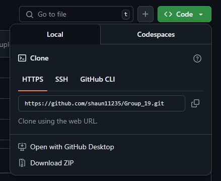

# COMP0197 Coursework 2
## Environment setup
The required packages are listed in the file `requirements.txt`. Follow the instructions to make sure that your environment is **reproducible** by everyone else in the group.  
1. Open a terminal and use `cd` to navigate to the root directory (where you want the files for this coursework to be in). 
2. Run the command `git clone <insert the URL of the repository>` (don't include the `<>`).
 
3. Run the command `conda env create -f env/environment.yml`.  

Now your environment should be ready, here are several commands that might be useful.  
- `conda info --envs`: to see all available environments, youshould see `comp0197-cw2-pt` among them.  
- `conda activate comp0197-cw2-pt`: activates the environment in terminal.
- `conda init` & `source activate`: If you cannot activate the environment try run these two commands first.

Want to add other packages? Add the names of them in `requirements.txt` and run the command `conda env update -f env/environment.yml --prune`(`prune` removes the packages which are not listed in `requirements.txt`).

## GitHub 101

Here are several commands that you will need.  

- `git clone`: Clones a remote repository to your local machine.  
- `git status`: Shows the current state of your working directory.  

In most cases, following these steps should be enough for you to upload your work.  

- `git pull`: Fetches and merges changes from the remote repository into your current branch.  
- `git add`: Adds file changes to the staging area, preparing them for a commit.  
- `git commit -m "Your commit message, EXPLAIN WHAT YOU HAVE DONE HERE"`: Commits the staged changes to the local repository with a descriptive message.  
- `git push`: Pushes your local commits to the remote repository.  

There are many more commands available (`branch`, `checkout`, etc.), check out https://training.github.com/downloads/zh_CN/github-git-cheat-sheet/, it should contain everything you need.  
Still confused? https://chatgpt.com/ would be happy to help.

## Few tips
- **Follow PEP8 Guidelines**:  
Adhere to the PEP8 style guide to ensure your Python code is clean, readable, and consistent. This makes it easier for everyone to understand and collaborate on the project.

- **Write Clear Commit Messages**:  
Use descriptive commit messages that explain what changes were made and why. Aim for clarity so that others (and your future self) can easily follow the history of your changes.

- **Keep Commits Focused**:  
Try to make small, focused commits rather than one large commit that covers many changes. This helps with debugging and understanding the evolution of the project.

- **Regularly Pull Changes**:  
Frequently pull from the remote repository to ensure your local branch is up-to-date, which minimizes merge conflicts when you push your changes.

- **Document Your Code**:  
Use comments and update the README file as needed to explain any non-obvious parts of your code or new features. Good documentation is essential for team collaboration and future maintenance.

## Dataset
Makesure that the dataset file paths look like this  
`dataset/`  
`└── oxford-iiit-pet/`  
`    ├── annotations/`  
`    ├── images/`  
`    └── test.jpg`  
